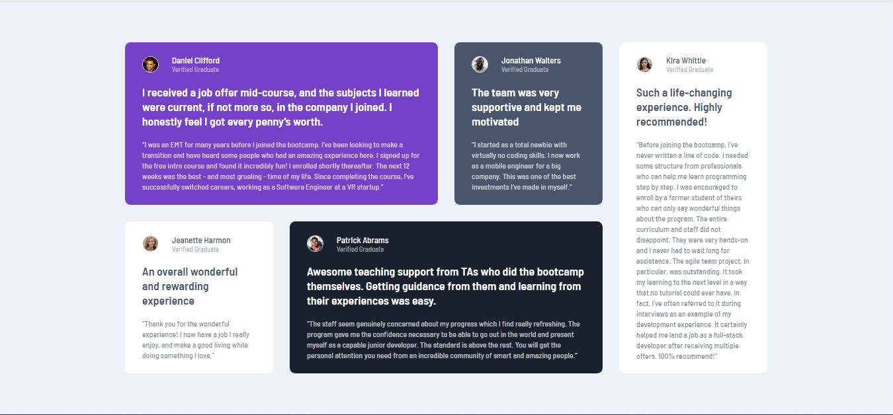
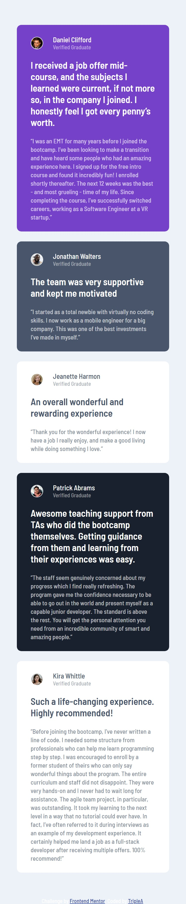

# Frontend Mentor - Testimonials grid section solution

This is a solution to the [Testimonials grid section challenge on Frontend Mentor](https://www.frontendmentor.io/challenges/testimonials-grid-section-Nnw6J7Un7). Frontend Mentor challenges help you improve your coding skills by building realistic projects. 

## Table of contents

- [Overview](#overview)
  - [The challenge](#the-challenge)
  - [Screenshot](#screenshot)
  - [Links](#links)
- [My process](#my-process)
  - [Built with](#built-with)
  - [What I learned](#what-i-learned)
  - [Continued development](#continued-development)
- [Author](#author)


## Overview

### The challenge

Users should be able to:

- View the optimal layout for the site depending on their device's screen size

### Screenshot


### Links

- Solution URL: [Add solution URL here](https://github.com/TRIPLE-ADE/Testimonials-grid-section-main)
- Live Site URL: [Add live site URL here](https://triple-ade.github.io/Testimonials-grid-section-main//)

## My process
 - Algorithm : Process and ways of arranging and solving the problem

 - implementation : Coding and debugging 
### Built with

- Semantic HTML5 markup
- CSS custom properties
- Css Grid

### What I learned

Use this section to recap over some of your major learnings while working through this project. Writing these out and providing code samples of areas you want to highlight is a great way to reinforce your own knowledge.

To see how you can add code snippets, see below:


```css
main{
    display: grid;
    place-items: center;
    width: 100%;
    min-height: 100vh;
}
section{
    padding:50px 0;
    width: 72%;
    display: grid;
    grid-template-columns:repeat(4,1fr);
    gap: 25px;
}
.patrick-info{
    grid-row: 2/3;
    grid-column: 2/4;
    background-color: var(--black);
}
.kira-info{
    grid-row:1/3;
    grid-column: 4;
}
```


### Continued development

Use this section to outline areas that you want to continue focusing on in future projects. These could be concepts you're still not completely comfortable with or techniques you found useful that you want to refine and perfect.

- css grid
- Clean Code
- code arrangement
- HTML5 semantics
- commenting

## Author

- Website - [TripleA](https://triple-ade.github.io/Testimonials-grid-section-main/)
- Frontend Mentor - [@TRIPLE-ADE](https://www.frontendmentor.io/profile/TRIPLE-ADE)
- Twitter - [@Triple123A](https://www.twitter.com/Triple123A)
